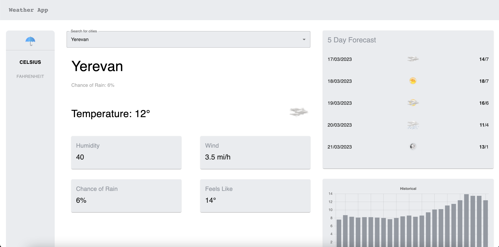

# Getting Started 

This is an example of how you may give instructions on setting up your project locally. To get a local copy up and running follow these simple example steps.

## Installation

1.Clone the repo

```
git clone https://github.com/MiqayelGalstyan/WeatherApp.git
```

2.Install NPM packages

```
npm install
```

### `npm start`

Runs the app in the development mode.\
Open [http://localhost:3000](http://localhost:3000) to view it in the browser.

The page will reload if you make edits.\
You will also see any lint errors in the console.


## Usage

You will see autocomplete input.

1.Search for a city and choose from a list.

2.You will see selected city data.





3.You will see buttons for switching between Celsius and Fahrenheit units in the left sidebar.


